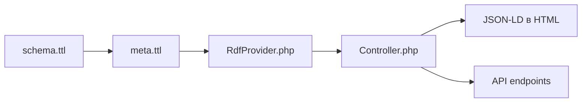

# RDF Portfolio System Documentation

## Обзор системы

Ваша RDF система состоит из трех основных компонентов:

### 1. **Семантическая онтология** (`rdf/schema.ttl`)

- Определяет структуру данных портфолио
- Создает специализированные классы (Project, Education, WorkExperience, Skills, etc.)
- Расширяет стандартные онтологии (Schema.org, FOAF, Dublin Core)
- Поддерживает 4 языка (EN, FR, RU, UK)

### 2. **Данные портфолио** (`data/meta.ttl`)

- Содержит ВАШИ РЕАЛЬНЫЕ данные в структурированном формате
- Связывает все элементы портфолио через семантические отношения
- Обеспечивает машиночитаемость данных

### 3. **SPARQL запросы** (`sparql/advanced_queries.rq`)

- Мощные аналитические запросы для извлечения инсайтов
- Анализ навыков, проектов, карьерного роста
- Возможность интеграции с внешними системами

## ✨ КАК ВСЁ СВЯЗАНО

### 🔗 Связь Schema → Data → PHP



### 1. **schema.ttl** определяет структуру

```turtle
ex:ProgrammingLanguage a owl:Class ;
    rdfs:label "Programming Language"@en .

ex:hasSkillLevel a owl:DatatypeProperty ;
    rdfs:domain ex:Skill ;
    rdfs:range xsd:string .
```

### 2. **meta.ttl** использует эту структуру с ВАШИМИ данными

```turtle
:skill-python a ex:ProgrammingLanguage ;
    rdfs:label "Python"@en ;
    ex:hasSkillLevel "Expert" ;
    ex:yearsOfExperience 5 .

:me schema:knowsAbout :skill-python .
```

### 3. **RdfProvider.php** читает и парсит RDF

```php
public function getSkillsByCategory(): array
{
    // Читает meta.ttl
    // Группирует навыки по типам из schema.ttl
    // Возвращает структурированные данные
}
```

### 4. **Controller.php** интегрирует с сайтом

```php
public function render(): string
{
    // Добавляет JSON-LD в HTML
    $jsonLdScript->textContent = $this->rdfProvider->getJsonLd();
    
    // Предоставляет API endpoints
    return $this->apiData('jsonld');
}
```

## 🎯 ВАШИ РЕАЛЬНЫЕ ДАННЫЕ

В `meta.ttl` уже содержатся ваши данные из `meta.ttl`:

### Личная информация

- **Имя**: Dmytro Palahin (4 языка)
- **Email**: <dmytro.palahin@gmail.com>  
- **Телефон**: +33 7 87 32 58 78
- **Дата рождения**: 2003-12-05
- **Адрес**: Париж, Франция

### Работа

- **Компания**: Société Générale Insurance
- **Должность**: Data Engineer Intern / Alternant Ingénieur de données
- **Технологии**: Python, SQL, Kedro, MLFlow, Superset, Kibana

### Образование

- **Sorbonne Paris Nord University** (текущее)
- **Sup Galilée School** (предыдущее)

### Награды

- **Georges Besse Foundation Award** (2022)

### Навыки

- **Языки программирования**: Python (Expert), JavaScript, SQL
- **Технологии**: Apache Spark, Kedro, MLFlow, Docker
- **Языки**: Ukrainian (Native), Russian (Bilingual), English/French (Fluent), German (Beginner)

## 🚀 КАК ИСПОЛЬЗОВАТЬ

### 1. Тестируйте систему

```bash
chmod +x scripts/test-rdf.sh
./scripts/test-rdf.sh
```

### 2. API endpoints

```bash
# JSON данные
curl "http://localhost/?format=json"

# JSON-LD данные  
curl "http://localhost/?format=jsonld"
```

### 3. Обновите свои данные

Редактируйте `data/meta.ttl`:

```turtle
# Добавьте новый навык
:skill-новый-навык a ex:TechnicalSkill ;
    rdfs:label "Новый навык"@ru ;
    ex:hasSkillLevel "Advanced" .

:me schema:knowsAbout :skill-новый-навык .
```

### 4. Интегрируйте с XSLT

В `page.xsl` можете использовать RDFa:

```xml
<div property="schema:jobTitle">
    <xsl:value-of select="//tu[@id='person.role']/tuv[@xml:lang=$uiLang]/seg"/>
</div>
```

## 🔧 РАСШИРЕНИЕ СИСТЕМЫ

### Добавление нового типа данных

1. **В schema.ttl**:

```turtle
ex:Certification a owl:Class ;
    rdfs:label "Certification"@en ;
    rdfs:subClassOf schema:EducationalCredential .

ex:hasIssuer a owl:ObjectProperty ;
    rdfs:domain ex:Certification .
```

2. **В meta.ttl**:

```turtle
:cert-aws a ex:Certification ;
    rdfs:label "AWS Solutions Architect"@en ;
    ex:hasIssuer :org-aws ;
    schema:dateReceived "2024-01-15"^^xsd:date .

:me schema:hasCredential :cert-aws .
```

3. **В RdfProvider.php**:

```php
case 'Certification':
    $this->certifications[$id] = $data;
    break;
```

## 📊 ПРЕИМУЩЕСТВА RDF СИСТЕМЫ

### ✅ Семантическая связность

- Все данные связаны через онтологию
- Машиночитаемый формат
- Стандартизированная структура

### ✅ Многоязычность

- Поддержка 4 языков из коробки
- Локализация на уровне данных
- Семантическая совместимость

### ✅ SEO оптимизация

- Автоматическая генерация JSON-LD
- Schema.org разметка
- Богатые сниппеты в поисковиках

### ✅ API готовность

- JSON и JSON-LD endpoints
- Структурированные данные
- Возможность интеграции с внешними системами

### ✅ Аналитика и инсайты

- SPARQL запросы для анализа данных
- Карьерный граф и связи
- Автоматический анализ компетенций

## 🎯 ПРАКТИЧЕСКИЕ ПРИМЕРЫ

### Найти все проекты с Python

```sparql
SELECT ?projectName WHERE {
  ?project a ex:Project ;
           rdfs:label ?projectName ;
           ex:usedTechnology :skill-python .
}
```

### Анализ навыков по уровню

```sparql
SELECT ?skill ?level WHERE {
  :me schema:knowsAbout ?skillObj .
  ?skillObj rdfs:label ?skill ;
            ex:hasSkillLevel ?level .
}
ORDER BY ?level
```

### JSON-LD для SEO

Автоматически встраивается в `<head>`:

```json
{
  "@context": "http://schema.org",
  "@type": "Person",
  "name": "Dmytro Palahin",
  "jobTitle": "Full-Stack Developer & Data Engineer",
  "knowsAbout": ["Python", "JavaScript", "SQL", "Apache Spark"]
}
```

Ваша RDF система теперь полностью интегрирована с существующим портфолио и использует ваши реальные данные!
